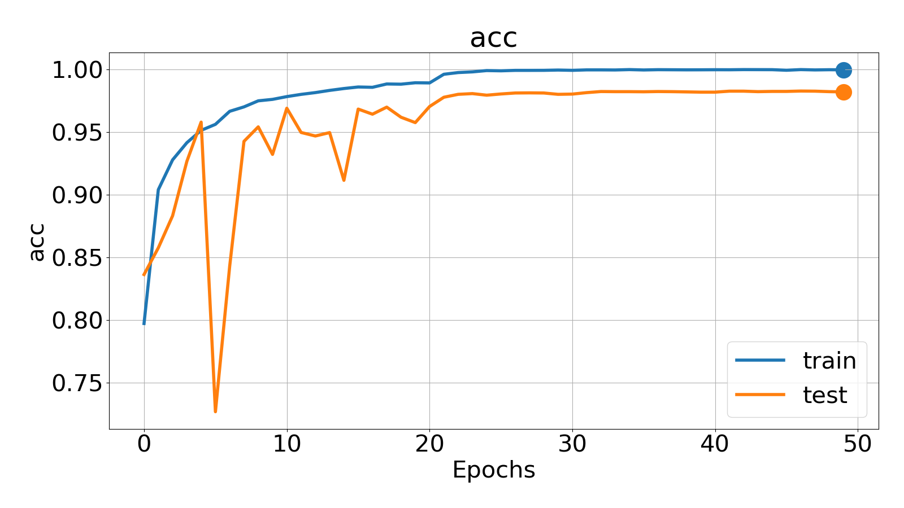
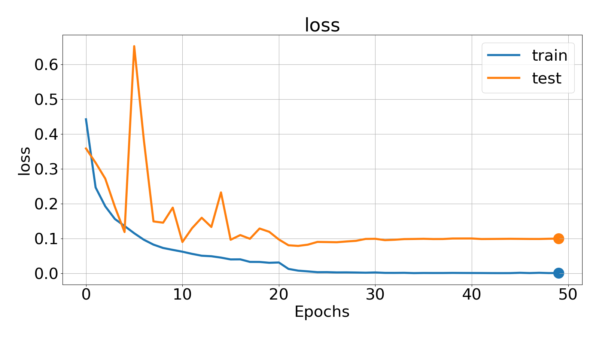

# Fake-face-detection

### Task
* Recognize fake videos - to train the binary classifier to distinguish real videos from fake ones
* Dataset consist of 40k images of two types - fake, not fake
* [link](https://www.kaggle.com/c/reface-fake-detection#) to task and dataset

### Done 
* Created model using MobileNetV2 with GRU combined.
* Trained for 6 hours on GPU 

 
 
 

